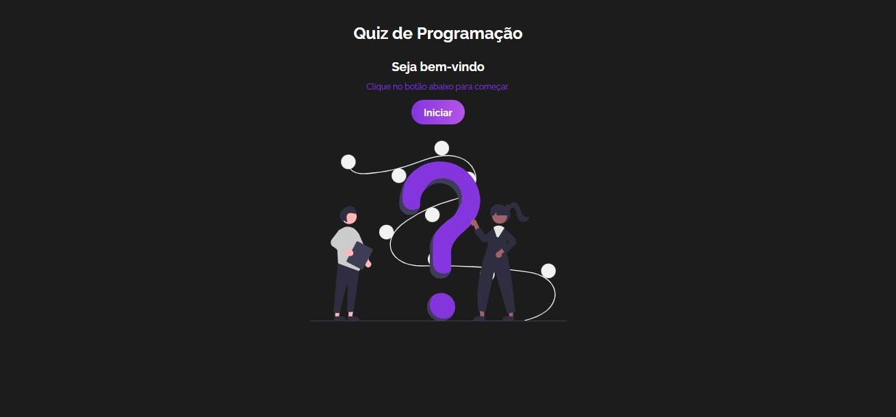
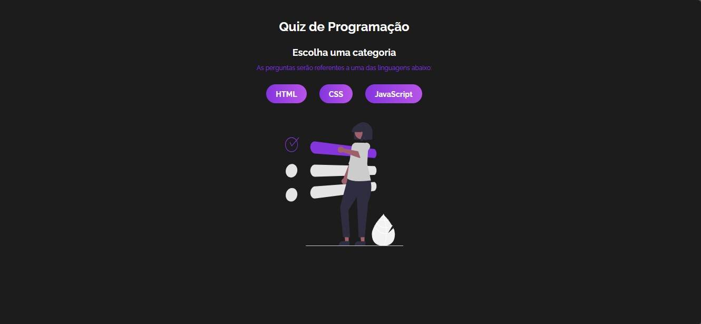
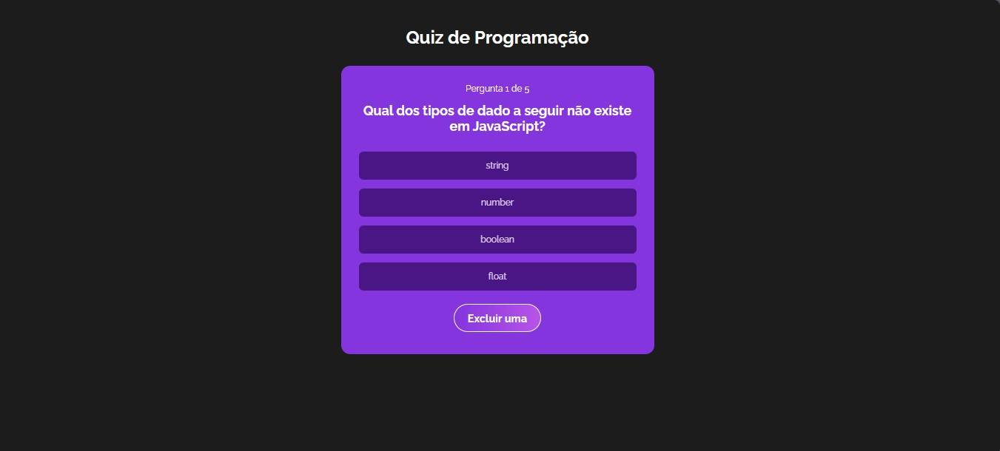
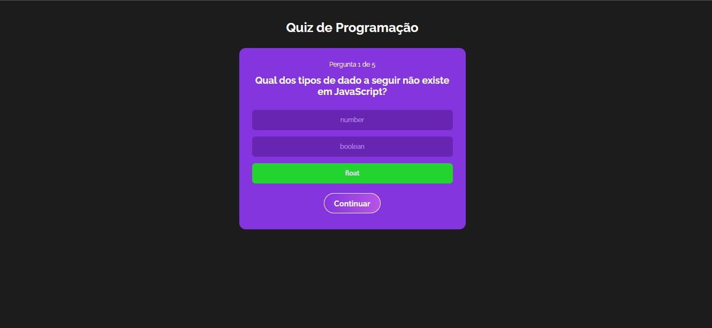
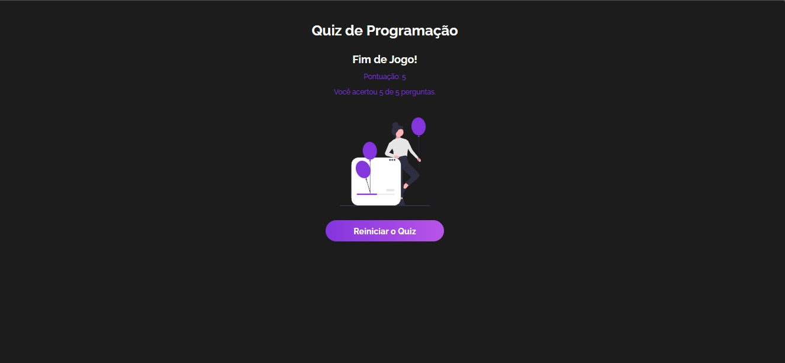

# Quiz de Programação com React

Este projeto é um quiz interativo desenvolvido com React, utilizando o Vite para build e desenvolvimento local rápido.

## 🎮 Sobre o projeto

O quiz permite que o usuário escolha entre as linguagens **HTML**, **CSS** e **JavaScript** e teste seus conhecimentos com perguntas de múltipla escolha.

## Telas do Quiz

### Tela 1: Tela de Início
A tela de início é onde o usuário começa o quiz. Ela apresenta um botão para iniciar o jogo.

### Tela 2: Escolha da Categoria
Após a tela de início, o usuário pode escolher a categoria do quiz.

### Tela 3: Perguntas com Opções
Nesta tela, as perguntas do quiz são exibidas com várias opções de resposta. O usuário deve selecionar uma das opções para continuar.

### Tela 4: Remover uma Opção e Acertar a Pergunta
Quando o usuário escolhe remover uma opção e acerta a pergunta, a tela é atualizada para mostrar a resposta correta e dar a pontuação ao usuário.

### Tela 5: Tela de Pontos
Por fim, a tela de pontos mostra a pontuação final do usuário ao terminar o quiz, permitindo que ele veja o desempenho alcançado.

### Funcionalidades:

- ✅ Escolha de categoria (HTML, CSS ou JavaScript)
- ✅ Perguntas de múltipla escolha
- ✅ Pontuação automática a cada resposta correta
- ✅ Opção de **pedir uma dica**
- ✅ Opção de **eliminar uma alternativa errada**
- ✅ Feedback visual sobre acertos e erros
- ✅ Interface responsiva e leve

## 🛠️ Tecnologias utilizadas

- [React](https://reactjs.org/)
- [Vite](https://vitejs.dev/)
- [JavaScript (ES6+)](https://developer.mozilla.org/en-US/docs/Web/JavaScript)
- [Context API](https://reactjs.org/docs/context.html)
- CSS
